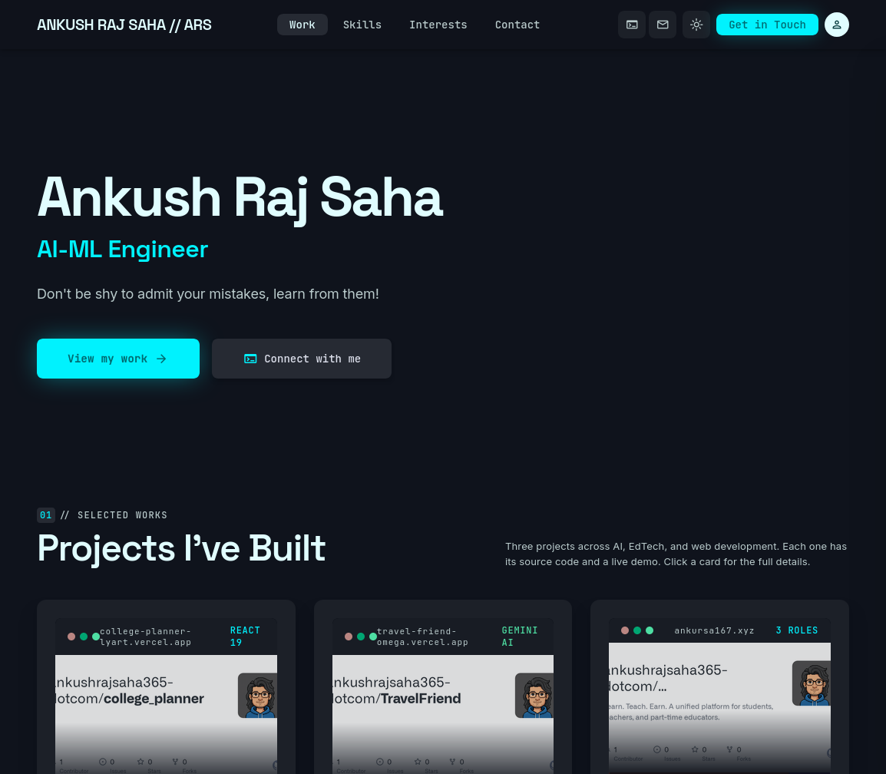
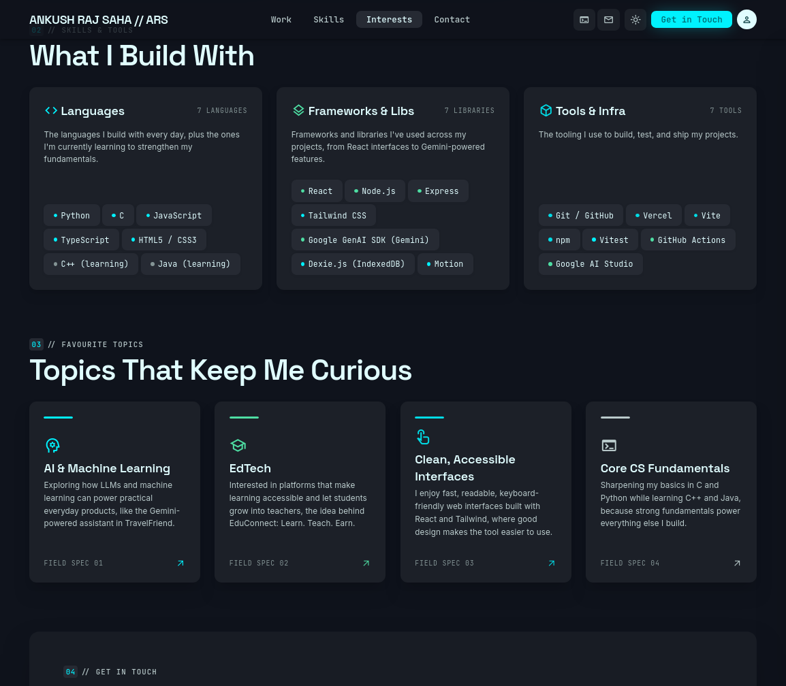

# Hi, I'm Ankush Raj Saha 👋

**AI-ML Engineer** · coding enthusiast · currently sharpening my C and Python

> "Don't be shy to admit your mistakes, learn from them!"

This is the source code of my personal portfolio website, where I show my best work, what I build with, and how to reach me.

🔗 **Live portfolio:** [portfolio-ebon-three-33.vercel.app](https://portfolio-ebon-three-33.vercel.app/)

<p align="center">
  
  
</p>

---

## 🧭 What's Inside

| Section | What you'll find |
| --- | --- |
| **Work** | My featured projects. Each card links to the source code and the live demo, and opens a full write-up when clicked. |
| **Skills** | The languages, frameworks, and tools I work with. |
| **Interests** | The topics I love exploring. |
| **Contact** | My email (one-click copy) and social links. |

There's also a dark / light mode toggle, and the site works on phones, tablets, and desktops.

---

## 🚀 Featured Projects

| Project | About | Code | Live |
| --- | --- | --- | --- |
| **College Planner** | A fast college planning dashboard built with React and Vite, with browser-side storage via Dexie. | [GitHub](https://github.com/ankushrajsaha365-dotcom/college_planner) | [Open](https://college-planner-lyart.vercel.app) |
| **TravelFriend** | An AI travel companion built with React, TypeScript, and the Google Gemini API. | [GitHub](https://github.com/ankushrajsaha365-dotcom/TravelFriend) | [Open](https://travel-friend-omega.vercel.app) |
| **EduConnect** | Learn. Teach. Earn. A role-based education platform where students learn and qualified students earn by teaching. | [GitHub](https://github.com/ankushrajsaha365-dotcom/Edu_connect_demo) | [Open](http://www.ankursa167.xyz/) |

---

## 🛠️ What I Work With

- **Languages:** Python, C, JavaScript, TypeScript, HTML5 / CSS3
- **Frameworks & libraries:** React, Node.js, Express, Tailwind CSS, Google GenAI SDK (Gemini), Dexie.js, Motion
- **Tools:** Git / GitHub, Vercel, Vite, npm, Vitest, GitHub Actions, Google AI Studio
- **Currently learning:** C++ and Java

---

## 🎨 About This Site

The portfolio is a lightweight static site with no build step:

- **Design:** Google Stitch
- **Built with:** HTML, Tailwind CSS, and vanilla JavaScript
- **Content:** all text, projects, and links come from a single file, `data.js`, so I can update the site without touching the layout

```
├── index.html   # Page structure and styling setup
├── style.css    # Custom styles
├── main.js      # Renders the content and handles the interactions
└── data.js      # All portfolio content
```

**Want to look around locally?** The site uses JavaScript modules, so it needs a small local server (double-clicking `index.html` won't work):

```bash
python -m http.server 8000
```

Then open `http://localhost:8000`.

---

## 📫 Let's Connect

I'm always happy to talk about AI, code, and EdTech, or hear about a project idea or opportunity.

- **Email:** [ankushrajsaha365@gmail.com](mailto:ankushrajsaha365@gmail.com)
- **GitHub:** [@ankushrajsaha365-dotcom](https://github.com/ankushrajsaha365-dotcom)
- **LinkedIn:** [Ankush Raj Saha](https://www.linkedin.com/in/ankush-raj-saha-365x/)

⚡ *Fun fact: my code runs on coffee, curiosity, and some music.*

---

© 2026 Ankush Raj Saha